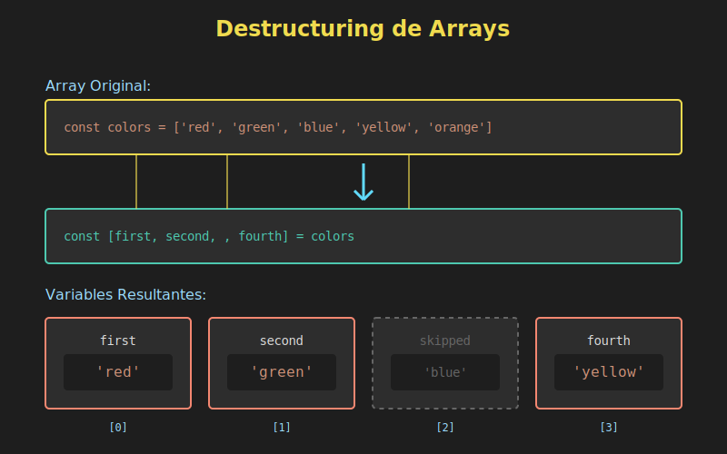

# 📦 Destructuring de Arrays



## 🎯 Objetivos

- Comprender qué es destructuring y por qué es útil
- Aplicar destructuring básico en arrays
- Utilizar el rest operator en destructuring
- Implementar valores por defecto
- Realizar intercambio de variables (swap)
- Usar destructuring en parámetros de funciones

---

## 📋 ¿Qué es Destructuring?

**Destructuring** es una sintaxis de JavaScript que permite extraer valores de arrays u objetos y asignarlos a variables de forma más concisa y legible.

### Antes de ES6 (forma tradicional)

```javascript
const colors = ['red', 'green', 'blue'];

const first = colors[0];
const second = colors[1];
const third = colors[2];

console.log(first);  // 'red'
console.log(second); // 'green'
console.log(third);  // 'blue'
```

### Con ES6 (destructuring)

```javascript
const colors = ['red', 'green', 'blue'];

const [first, second, third] = colors;

console.log(first);  // 'red'
console.log(second); // 'green'
console.log(third);  // 'blue'
```

**Ventajas**:
- ✅ Código más conciso
- ✅ Más legible e intuitivo
- ✅ Menos propenso a errores
- ✅ Mejor expresión de intención

---

## 1️⃣ Destructuring Básico

### Sintaxis Fundamental

```javascript
const array = [valor1, valor2, valor3];
const [variable1, variable2, variable3] = array;
```

### Ejemplos Prácticos

```javascript
// Coordenadas
const coordinates = [40.4168, -3.7038]; // Madrid
const [latitude, longitude] = coordinates;

console.log(latitude);  // 40.4168
console.log(longitude); // -3.7038

// Fechas
const today = [2025, 12, 18]; // Año, mes, día
const [year, month, day] = today;

console.log(`${day}/${month}/${year}`); // '18/12/2025'

// Respuestas de API
const apiResponse = [true, 'Success', { data: [] }];
const [success, message, payload] = apiResponse;

console.log(success); // true
console.log(message); // 'Success'
```

---

## 2️⃣ Omitir Elementos

Puedes omitir elementos que no necesitas usando comas:

```javascript
const colors = ['red', 'green', 'blue', 'yellow', 'purple'];

// Solo queremos el primero y el tercero
const [first, , third] = colors;

console.log(first); // 'red'
console.log(third); // 'blue'

// Solo queremos el último
const [, , , , last] = colors;
console.log(last); // 'purple'

// Primero y cuarto
const [primary, , , quaternary] = colors;
console.log(primary);    // 'red'
console.log(quaternary); // 'yellow'
```

---

## 3️⃣ Rest Operator (...)

El **rest operator** captura el "resto" de elementos en un nuevo array:

### Sintaxis

```javascript
const [first, ...rest] = array;
```

### Ejemplos

```javascript
const numbers = [1, 2, 3, 4, 5, 6, 7, 8, 9, 10];

const [first, second, ...others] = numbers;

console.log(first);  // 1
console.log(second); // 2
console.log(others); // [3, 4, 5, 6, 7, 8, 9, 10]

// Separar cabecera de contenido
const csvRow = ['ID', 'Name', 'Age', 'City', 'Country'];
const [id, name, ...metadata] = csvRow;

console.log(id);       // 'ID'
console.log(name);     // 'Name'
console.log(metadata); // ['Age', 'City', 'Country']

// Primero y resto
const scores = [98, 95, 92, 88, 85, 82];
const [highest, ...remaining] = scores;

console.log(highest);   // 98
console.log(remaining); // [95, 92, 88, 85, 82]
```

**⚠️ Importante**: El rest operator solo puede usarse en la última posición:

```javascript
// ✅ CORRECTO
const [first, ...rest] = array;

// ❌ INCORRECTO - SyntaxError
const [...rest, last] = array;
const [first, ...rest, last] = array;
```

---

## 4️⃣ Valores por Defecto

Puedes asignar valores por defecto para el caso en que el array no tenga suficientes elementos:

### Sintaxis

```javascript
const [variable = defaultValue] = array;
```

### Ejemplos

```javascript
// Array con menos elementos de los esperados
const colors = ['red'];

const [primary = 'black', secondary = 'white'] = colors;

console.log(primary);   // 'red' (del array)
console.log(secondary); // 'white' (valor por defecto)

// Configuración con defaults
const userSettings = ['dark'];

const [theme = 'light', language = 'en', fontSize = 14] = userSettings;

console.log(theme);    // 'dark'
console.log(language); // 'en'
console.log(fontSize); // 14

// API response con datos opcionales
const response = [200, 'OK'];

const [status, message, data = null, timestamp = Date.now()] = response;

console.log(status);    // 200
console.log(message);   // 'OK'
console.log(data);      // null
console.log(timestamp); // timestamp actual
```

**Nota sobre `undefined`**:

```javascript
const values = [1, undefined, 3];

const [a, b = 2, c] = values;

console.log(a); // 1
console.log(b); // 2 (usa el default porque el valor es undefined)
console.log(c); // 3

// null NO activa el valor por defecto
const values2 = [1, null, 3];
const [x, y = 2, z] = values2;

console.log(y); // null (no 2, porque null !== undefined)
```

---

## 5️⃣ Intercambio de Variables (Swap)

Una de las aplicaciones más elegantes del destructuring es intercambiar valores de variables sin usar variable temporal:

### Forma Tradicional

```javascript
let a = 1;
let b = 2;

// Necesitamos variable temporal
let temp = a;
a = b;
b = temp;

console.log(a); // 2
console.log(b); // 1
```

### Con Destructuring

```javascript
let a = 1;
let b = 2;

[a, b] = [b, a];

console.log(a); // 2
console.log(b); // 1
```

### Casos de Uso

```javascript
// Ordenar dos números
let min = 5;
let max = 3;

if (min > max) {
  [min, max] = [max, min];
}

console.log(min, max); // 3 5

// Rotar valores
let [x, y, z] = [1, 2, 3];

[x, y, z] = [z, x, y]; // Rotación a la derecha

console.log(x, y, z); // 3 1 2

// Invertir coordenadas
let coordinates = [40.4168, -3.7038];

coordinates = [coordinates[1], coordinates[0]];
// o mejor:
[coordinates[0], coordinates[1]] = [coordinates[1], coordinates[0]];
```

---

## 6️⃣ Destructuring en Parámetros de Funciones

Puedes usar destructuring directamente en los parámetros de una función:

### Sintaxis Básica

```javascript
const processCoordinates = ([lat, lng]) => {
  console.log(`Latitude: ${lat}, Longitude: ${lng}`);
};

processCoordinates([40.4168, -3.7038]);
// Latitude: 40.4168, Longitude: -3.7038
```

### Con Valores por Defecto

```javascript
const createPoint = ([x = 0, y = 0, z = 0] = []) => {
  return { x, y, z };
};

console.log(createPoint([10, 20, 30])); // { x: 10, y: 20, z: 30 }
console.log(createPoint([10, 20]));     // { x: 10, y: 20, z: 0 }
console.log(createPoint([10]));         // { x: 10, y: 0, z: 0 }
console.log(createPoint());             // { x: 0, y: 0, z: 0 }
```

### Con Rest Operator

```javascript
const sum = ([first, ...rest]) => {
  return rest.reduce((acc, num) => acc + num, first);
};

console.log(sum([1, 2, 3, 4, 5])); // 15

// Función para procesar primero y resto
const processFirst = ([head, ...tail]) => {
  console.log('First:', head);
  console.log('Rest:', tail);
};

processFirst(['apple', 'banana', 'orange']);
// First: apple
// Rest: ['banana', 'orange']
```

---

## 7️⃣ Destructuring Anidado (Preview)

También puedes destructurar arrays dentro de arrays:

```javascript
const matrix = [
  [1, 2, 3],
  [4, 5, 6],
  [7, 8, 9]
];

const [[a, b, c], [d, e, f], [g, h, i]] = matrix;

console.log(a, b, c); // 1 2 3
console.log(d, e, f); // 4 5 6
console.log(g, h, i); // 7 8 9

// Solo ciertos elementos
const [[first], , [, , last]] = matrix;
console.log(first, last); // 1 9
```

---

## 💡 Casos de Uso Prácticos

### 1. Trabajar con `String.split()`

```javascript
const fullName = 'Ana María García López';

const [firstName, ...lastNames] = fullName.split(' ');

console.log(firstName);        // 'Ana'
console.log(lastNames.join(' ')); // 'María García López'
```

### 2. Iterar sobre Arrays de Arrays

```javascript
const users = [
  ['Ana', 'ana@example.com'],
  ['Carlos', 'carlos@example.com'],
  ['María', 'maria@example.com']
];

users.forEach(([name, email]) => {
  console.log(`${name}: ${email}`);
});
// Ana: ana@example.com
// Carlos: carlos@example.com
// María: maria@example.com
```

### 3. Trabajar con `Object.entries()`

```javascript
const config = {
  theme: 'dark',
  language: 'es',
  fontSize: 14
};

Object.entries(config).forEach(([key, value]) => {
  console.log(`${key} = ${value}`);
});
// theme = dark
// language = es
// fontSize = 14
```

### 4. Procesamiento de Datos

```javascript
const parseCSVRow = row => {
  const [id, name, age, city = 'Unknown'] = row.split(',');
  return { id: parseInt(id), name, age: parseInt(age), city };
};

const user = parseCSVRow('1,Ana García,28,Madrid');
console.log(user);
// { id: 1, name: 'Ana García', age: 28, city: 'Madrid' }
```

### 5. Funciones que Retornan Múltiples Valores

```javascript
const getMinMax = numbers => {
  return [Math.min(...numbers), Math.max(...numbers)];
};

const [min, max] = getMinMax([5, 2, 8, 1, 9, 3]);
console.log(min, max); // 1 9
```

---

## ⚠️ Errores Comunes

### 1. No Usar const/let

```javascript
// ❌ INCORRECTO
[a, b] = [1, 2]; // ReferenceError si a y b no existen

// ✅ CORRECTO
const [a, b] = [1, 2];
// o si necesitas reasignar:
let [x, y] = [1, 2];
[x, y] = [3, 4]; // Esto sí está bien
```

### 2. Confundir Rest con Spread

```javascript
// REST (en destructuring, agrupa elementos)
const [first, ...rest] = [1, 2, 3];
console.log(rest); // [2, 3]

// SPREAD (expande elementos)
const arr = [1, 2, 3];
console.log(...arr); // 1 2 3
```

### 3. Rest Operator en Posición Incorrecta

```javascript
// ❌ INCORRECTO
const [...rest, last] = [1, 2, 3, 4];

// ✅ CORRECTO
const [first, ...rest] = [1, 2, 3, 4];
```

---

## 🎯 Ejercicios Prácticos

### Ejercicio 1: Básico

```javascript
// Dado este array:
const data = [42, 'Hello', true, null, undefined];

// Extrae los primeros 3 elementos en variables
// Tu código aquí:
```

<details>
<summary>Ver solución</summary>

```javascript
const [number, text, boolean] = data;
console.log(number, text, boolean); // 42 'Hello' true
```
</details>

### Ejercicio 2: Rest Operator

```javascript
// Dado este array:
const scores = [95, 88, 76, 92, 84];

// Extrae el primero como 'highest' y el resto como 'others'
// Tu código aquí:
```

<details>
<summary>Ver solución</summary>

```javascript
const [highest, ...others] = scores;
console.log(highest); // 95
console.log(others);  // [88, 76, 92, 84]
```
</details>

### Ejercicio 3: Swap

```javascript
// Intercambia estos valores sin variable temporal
let firstName = 'Ana';
let lastName = 'García';

// Tu código aquí:

// Resultado: firstName = 'García', lastName = 'Ana'
```

<details>
<summary>Ver solución</summary>

```javascript
[firstName, lastName] = [lastName, firstName];
console.log(firstName, lastName); // 'García' 'Ana'
```
</details>

### Ejercicio 4: Función con Destructuring

```javascript
// Crea una función que reciba un array [min, max]
// y retorne un número aleatorio entre esos valores
const getRandomInRange = (/* tu código */) => {
  // Implementación
};

console.log(getRandomInRange([1, 10])); // número entre 1 y 10
```

<details>
<summary>Ver solución</summary>

```javascript
const getRandomInRange = ([min, max]) => {
  return Math.floor(Math.random() * (max - min + 1)) + min;
};

console.log(getRandomInRange([1, 10]));
```
</details>

---

## ✅ Mejores Prácticas

1. **Usa const por defecto**
   ```javascript
   // ✅ Bueno
   const [x, y] = coordinates;

   // ⚠️ Solo si necesitas reasignar
   let [a, b] = values;
   ```

2. **Nombres descriptivos**
   ```javascript
   // ✅ Bueno
   const [latitude, longitude] = coordinates;

   // ❌ Malo
   const [x, y] = coordinates;
   ```

3. **Valores por defecto cuando sea apropiado**
   ```javascript
   // ✅ Bueno
   const [theme = 'light', language = 'en'] = settings;
   ```

4. **No exageres con omisiones**
   ```javascript
   // ❌ Difícil de leer
   const [, , , , fifth] = array;

   // ✅ Mejor
   const fifth = array[4];
   ```

5. **Usa rest para flexibilidad**
   ```javascript
   // ✅ Bueno - maneja arrays de cualquier tamaño
   const [first, ...rest] = array;
   ```

---

## 📚 Recursos Adicionales

- [MDN: Destructuring Assignment](https://developer.mozilla.org/es/docs/Web/JavaScript/Reference/Operators/Destructuring_assignment)
- [JavaScript.info: Destructuring](https://javascript.info/destructuring-assignment)
- [Exploring JS: Destructuring](https://exploringjs.com/es6/ch_destructuring.html)

---

## 🔗 Navegación

- [← README Week 04](../README.md)
- [Destructuring de Objetos →](02-destructuring-objects.md)
- [📑 Ver todos los temas](../README.md#-contenidos)

---

**Próximo tema**: Destructuring de Objetos - aprenderás a extraer propiedades de objetos con alias y valores por defecto.
