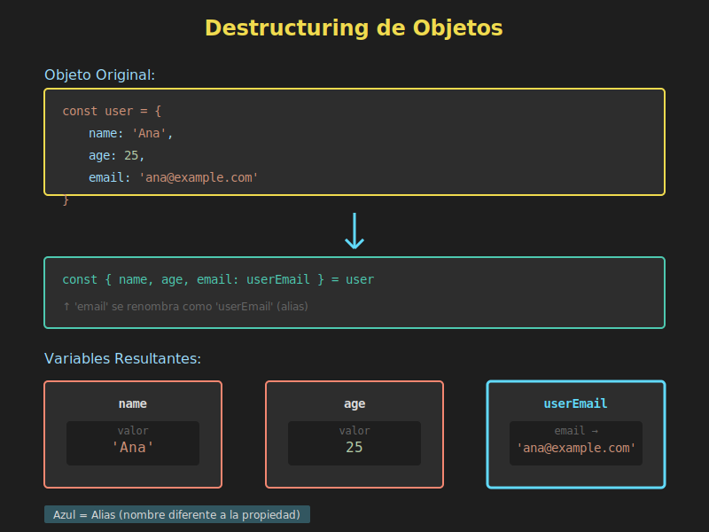

# 🎯 Destructuring de Objetos



## 🎯 Objetivos

- Dominar la sintaxis de destructuring en objetos
- Aplicar alias (renombrado) de propiedades
- Utilizar valores por defecto efectivamente
- Implementar destructuring anidado
- Usar computed property names
- Aplicar destructuring en parámetros de funciones

---

## 📋 Introducción

El **destructuring de objetos** permite extraer propiedades de un objeto y asignarlas a variables de forma concisa y expresiva. A diferencia de los arrays (que usan posición), los objetos usan **nombres de propiedades**.

### Antes de ES6

```javascript
const user = {
  name: 'Ana García',
  email: 'ana@example.com',
  age: 28,
  city: 'Madrid'
};

const name = user.name;
const email = user.email;
const age = user.age;
const city = user.city;
```

### Con ES6

```javascript
const user = {
  name: 'Ana García',
  email: 'ana@example.com',
  age: 28,
  city: 'Madrid'
};

const { name, email, age, city } = user;

console.log(name);  // 'Ana García'
console.log(email); // 'ana@example.com'
console.log(age);   // 28
console.log(city);  // 'Madrid'
```

---

## 1️⃣ Destructuring Básico

### Sintaxis Fundamental

```javascript
const { propiedad1, propiedad2 } = objeto;
```

### Ejemplos Prácticos

```javascript
// Configuración de usuario
const settings = {
  theme: 'dark',
  language: 'es',
  fontSize: 14,
  notifications: true
};

const { theme, language, fontSize } = settings;

console.log(theme);    // 'dark'
console.log(language); // 'es'
console.log(fontSize); // 14

// Respuesta de API
const apiResponse = {
  status: 200,
  message: 'Success',
  data: { users: [] },
  timestamp: Date.now()
};

const { status, message, data } = apiResponse;

console.log(status);  // 200
console.log(message); // 'Success'

// Objeto con métodos
const calculator = {
  add: (a, b) => a + b,
  subtract: (a, b) => a - b,
  multiply: (a, b) => a * b
};

const { add, multiply } = calculator;

console.log(add(5, 3));      // 8
console.log(multiply(4, 7)); // 28
```

**⚠️ Importante**: Las variables deben tener el mismo nombre que las propiedades del objeto (a menos que uses alias).

---

## 2️⃣ Renombrar Variables (Alias)

Puedes asignar las propiedades a variables con nombres diferentes usando el operador `:`:

### Sintaxis

```javascript
const { propiedadOriginal: nuevoNombre } = objeto;
```

### Ejemplos

```javascript
const user = {
  name: 'Carlos López',
  email: 'carlos@example.com',
  age: 32
};

// Renombrar 'email' a 'correo'
const { name, email: correo, age: edad } = user;

console.log(name);   // 'Carlos López'
console.log(correo); // 'carlos@example.com'
console.log(edad);   // 32

// Evitar conflictos de nombres
const student = { name: 'María', id: 1 };
const teacher = { name: 'Juan', id: 2 };

const { name: studentName, id: studentId } = student;
const { name: teacherName, id: teacherId } = teacher;

console.log(studentName, teacherName); // 'María' 'Juan'

// API con nombres poco convencionales
const response = {
  'user-name': 'Ana',
  'user-email': 'ana@example.com',
  'is-active': true
};

const {
  'user-name': username,
  'user-email': email,
  'is-active': isActive
} = response;

console.log(username); // 'Ana'
console.log(isActive); // true
```

---

## 3️⃣ Valores por Defecto

Asigna valores por defecto para propiedades que podrían no existir:

### Sintaxis

```javascript
const { propiedad = valorPorDefecto } = objeto;
```

### Ejemplos

```javascript
const config = {
  theme: 'dark',
  language: 'es'
};

const {
  theme = 'light',
  language = 'en',
  fontSize = 14,
  notifications = true
} = config;

console.log(theme);         // 'dark' (del objeto)
console.log(language);      // 'es' (del objeto)
console.log(fontSize);      // 14 (valor por defecto)
console.log(notifications); // true (valor por defecto)

// Configuración de función
const options = { width: 800 };

const {
  width = 600,
  height = 400,
  title = 'Untitled'
} = options;

console.log(width, height, title); // 800 400 'Untitled'
```

### Combinando Alias y Valores por Defecto

```javascript
const user = {
  name: 'Pedro',
  email: 'pedro@example.com'
};

const {
  name: userName = 'Anonymous',
  email: userEmail = 'no-email@example.com',
  role: userRole = 'guest',
  country: userCountry = 'España'
} = user;

console.log(userName);    // 'Pedro'
console.log(userEmail);   // 'pedro@example.com'
console.log(userRole);    // 'guest'
console.log(userCountry); // 'España'
```

**Nota sobre `undefined`**:

```javascript
const obj = {
  a: 1,
  b: undefined,
  c: null
};

const { a = 10, b = 20, c = 30 } = obj;

console.log(a); // 1 (valor del objeto)
console.log(b); // 20 (undefined activa el default)
console.log(c); // null (null NO activa el default)
```

---

## 4️⃣ Rest Properties

Similar a los arrays, puedes capturar el "resto" de las propiedades:

### Sintaxis

```javascript
const { prop1, prop2, ...resto } = objeto;
```

### Ejemplos

```javascript
const user = {
  id: 1,
  name: 'Ana García',
  email: 'ana@example.com',
  age: 28,
  city: 'Madrid',
  country: 'España'
};

const { id, name, ...details } = user;

console.log(id);   // 1
console.log(name); // 'Ana García'
console.log(details);
// {
//   email: 'ana@example.com',
//   age: 28,
//   city: 'Madrid',
//   country: 'España'
// }

// Separar datos sensibles
const userWithPassword = {
  username: 'anagarcia',
  password: 'secret123',
  email: 'ana@example.com',
  role: 'admin'
};

const { password, ...safeUserData } = userWithPassword;

console.log(safeUserData);
// { username: 'anagarcia', email: 'ana@example.com', role: 'admin' }
// password no está incluido
```

---

## 5️⃣ Destructuring Anidado

Puedes destructurar objetos dentro de objetos:

### Sintaxis Básica

```javascript
const {
  nivel1: {
    nivel2
  }
} = objeto;
```

### Ejemplos

```javascript
const user = {
  name: 'Carlos López',
  address: {
    street: 'Gran Vía 123',
    city: 'Madrid',
    country: 'España',
    coordinates: {
      lat: 40.4168,
      lng: -3.7038
    }
  }
};

// Destructuring anidado
const {
  name,
  address: {
    city,
    country,
    coordinates: { lat, lng }
  }
} = user;

console.log(name);    // 'Carlos López'
console.log(city);    // 'Madrid'
console.log(country); // 'España'
console.log(lat, lng); // 40.4168 -3.7038

// Nota: 'address' y 'coordinates' NO se crean como variables
// Solo se crean: name, city, country, lat, lng
```

### Con Valores por Defecto

```javascript
const user = {
  name: 'María',
  settings: {
    theme: 'dark'
  }
};

const {
  name,
  settings: {
    theme = 'light',
    language = 'es',
    fontSize = 14
  } = {}
} = user;

console.log(theme);    // 'dark'
console.log(language); // 'es'
console.log(fontSize); // 14

// El = {} al final previene errores si 'settings' no existe
```

---

## 6️⃣ Destructuring en Parámetros de Funciones

Una de las aplicaciones más poderosas del destructuring:

### Sintaxis Básica

```javascript
const funcion = ({ prop1, prop2 }) => {
  // usar prop1 y prop2
};
```

### Ejemplos

```javascript
// Configuración de funciones
const createUser = ({ name, email, role = 'user' }) => {
  return {
    id: Date.now(),
    name,
    email,
    role,
    createdAt: new Date()
  };
};

const user = createUser({
  name: 'Ana García',
  email: 'ana@example.com'
});

console.log(user);
// {
//   id: 1703779200000,
//   name: 'Ana García',
//   email: 'ana@example.com',
//   role: 'user',
//   createdAt: 2025-12-18T...
// }

// Opciones de renderizado
const renderWidget = ({
  width = 300,
  height = 200,
  color = 'blue',
  border = true
}) => {
  console.log(`Rendering ${width}x${height} widget`);
  console.log(`Color: ${color}, Border: ${border}`);
};

renderWidget({ width: 500, height: 400 });
// Rendering 500x400 widget
// Color: blue, Border: true
```

### Con Valores por Defecto para Todo el Objeto

```javascript
const greet = ({ name, greeting = 'Hello' } = {}) => {
  console.log(`${greeting}, ${name}!`);
};

greet({ name: 'Ana' });              // Hello, Ana!
greet({ name: 'Carlos', greeting: 'Hola' }); // Hola, Carlos!
greet();  // Error sin el = {}

// Con el = {} al final:
const greet2 = ({ name = 'Guest', greeting = 'Hello' } = {}) => {
  console.log(`${greeting}, ${name}!`);
};

greet2();  // Hello, Guest! (ahora funciona)
```

### Destructuring Anidado en Parámetros

```javascript
const displayUser = ({
  name,
  address: { city, country }
}) => {
  console.log(`${name} lives in ${city}, ${country}`);
};

displayUser({
  name: 'Ana García',
  address: {
    city: 'Madrid',
    country: 'España'
  }
});
// Ana García lives in Madrid, España
```

---

## 7️⃣ Computed Property Names

Puedes usar variables como nombres de propiedades:

```javascript
const key = 'email';

const user = {
  name: 'Ana',
  email: 'ana@example.com',
  age: 28
};

const { [key]: value } = user;

console.log(value); // 'ana@example.com'

// Dinámico
const getProperty = (obj, propName) => {
  const { [propName]: value } = obj;
  return value;
};

console.log(getProperty(user, 'name')); // 'Ana'
console.log(getProperty(user, 'age'));  // 28
```

---

## 💡 Casos de Uso Prácticos

### 1. Configuración de Componentes

```javascript
const createButton = ({
  text = 'Click me',
  type = 'button',
  disabled = false,
  onClick = () => {}
}) => {
  return {
    element: 'button',
    text,
    type,
    disabled,
    onClick
  };
};

const submitButton = createButton({
  text: 'Submit',
  type: 'submit',
  onClick: () => console.log('Submitted!')
});
```

### 2. Trabajar con APIs

```javascript
const processAPIResponse = ({
  status,
  data: { users, total },
  message = 'Success'
}) => {
  if (status === 200) {
    console.log(`${message}: ${total} users found`);
    return users;
  }
};

const response = {
  status: 200,
  data: {
    users: [{ name: 'Ana' }, { name: 'Carlos' }],
    total: 2
  }
};

processAPIResponse(response);
```

### 3. Extraer Propiedades Específicas

```javascript
const filterUserData = user => {
  const { id, name, email } = user;
  return { id, name, email };
};

const fullUser = {
  id: 1,
  name: 'Ana',
  email: 'ana@example.com',
  password: 'secret',
  token: 'abc123',
  lastLogin: '2025-12-18'
};

const publicUser = filterUserData(fullUser);
console.log(publicUser); // { id: 1, name: 'Ana', email: 'ana@example.com' }
```

### 4. Swap de Propiedades

```javascript
let config = {
  primary: 'blue',
  secondary: 'red'
};

// Swap usando destructuring
({ primary: config.secondary, secondary: config.primary } = 
  { primary: config.primary, secondary: config.secondary });

console.log(config); // { primary: 'red', secondary: 'blue' }
// Se intercambiaron los valores
```

### 5. Opciones con Defaults

```javascript
class HTTPClient {
  constructor({
    baseURL,
    timeout = 5000,
    headers = {},
    retries = 3
  } = {}) {
    this.baseURL = baseURL;
    this.timeout = timeout;
    this.headers = headers;
    this.retries = retries;
  }
}

const client = new HTTPClient({
  baseURL: 'https://api.example.com'
});
// timeout: 5000, headers: {}, retries: 3 (usando defaults)
```

---

## ⚠️ Errores Comunes

### 1. Olvidar const/let

```javascript
// ❌ INCORRECTO
{ name, email } = user; // SyntaxError

// ✅ CORRECTO
const { name, email } = user;
```

### 2. Confundir Alias con Valores por Defecto

```javascript
const user = { name: 'Ana' };

// ❌ INCORRECTO - intenta renombrar, no asignar default
const { name: 'Anonymous' } = user; // SyntaxError

// ✅ CORRECTO - valor por defecto
const { name = 'Anonymous' } = user;

// ✅ CORRECTO - alias + default
const { name: userName = 'Anonymous' } = user;
```

### 3. Orden de Alias y Default

```javascript
// ❌ INCORRECTO
const { name = 'Guest': userName } = user; // SyntaxError

// ✅ CORRECTO
const { name: userName = 'Guest' } = user;
//         ^alias    ^default
```

### 4. Destructuring de null/undefined

```javascript
const data = null;

// ❌ ERROR - Cannot destructure null
const { name } = data; // TypeError

// ✅ CORRECTO - usar defaults
const { name } = data || {};
const { name } = data ?? {};
```

---

## 🎯 Ejercicios Prácticos

### Ejercicio 1: Básico

```javascript
const product = {
  id: 101,
  name: 'Laptop',
  price: 999,
  category: 'Electronics'
};

// Extrae name y price
// Tu código aquí:
```

<details>
<summary>Ver solución</summary>

```javascript
const { name, price } = product;
console.log(name, price); // 'Laptop' 999
```
</details>

### Ejercicio 2: Con Alias

```javascript
const apiResponse = {
  user_name: 'Ana',
  user_email: 'ana@example.com',
  user_role: 'admin'
};

// Renombra a userName, userEmail, userRole
// Tu código aquí:
```

<details>
<summary>Ver solución</summary>

```javascript
const {
  user_name: userName,
  user_email: userEmail,
  user_role: userRole
} = apiResponse;
```
</details>

### Ejercicio 3: Con Defaults

```javascript
const settings = {
  theme: 'dark'
};

// Extrae theme, language (default: 'en'), fontSize (default: 14)
// Tu código aquí:
```

<details>
<summary>Ver solución</summary>

```javascript
const {
  theme,
  language = 'en',
  fontSize = 14
} = settings;

console.log(theme, language, fontSize); // 'dark' 'en' 14
```
</details>

### Ejercicio 4: Función con Destructuring

```javascript
// Crea una función que reciba un objeto de usuario
// y retorne un string de presentación
const introduce = (/* tu código */) => {
  // Implementación
};

introduce({
  name: 'Ana',
  age: 28,
  city: 'Madrid'
});
// Debería retornar: "Hola, soy Ana, tengo 28 años y vivo en Madrid"
```

<details>
<summary>Ver solución</summary>

```javascript
const introduce = ({ name, age, city }) => {
  return `Hola, soy ${name}, tengo ${age} años y vivo en ${city}`;
};
```
</details>

---

## ✅ Mejores Prácticas

1. **Usa destructuring en parámetros de funciones**
   ```javascript
   // ✅ Bueno - claro qué espera la función
   const createUser = ({ name, email, role }) => { };

   // ❌ Malo - menos claro
   const createUser = (options) => {
     const name = options.name;
     const email = options.email;
   };
   ```

2. **Valores por defecto apropiados**
   ```javascript
   // ✅ Bueno
   const { theme = 'light', language = 'en' } = config;
   ```

3. **Evita anidamiento excesivo**
   ```javascript
   // ❌ Difícil de leer
   const { a: { b: { c: { d } } } } = obj;

   // ✅ Mejor - paso a paso si es necesario
   const { a } = obj;
   const { b } = a;
   const { c } = b;
   ```

4. **Nombres descriptivos con alias**
   ```javascript
   // ✅ Bueno
   const { 'user-name': userName } = data;
   ```

---

## 📚 Recursos Adicionales

- [MDN: Destructuring Objects](https://developer.mozilla.org/es/docs/Web/JavaScript/Reference/Operators/Destructuring_assignment#desestructuración_de_objetos)
- [JavaScript.info: Destructuring](https://javascript.info/destructuring-assignment#object-destructuring)

---

## 🔗 Navegación

- [← Destructuring de Arrays](01-destructuring-arrays.md)
- [Destructuring Anidado →](03-destructuring-anidado.md)
- [📑 Ver todos los temas](../README.md#-contenidos)

---

**Próximo tema**: Destructuring Anidado - aprenderás a trabajar con estructuras de datos complejas.
