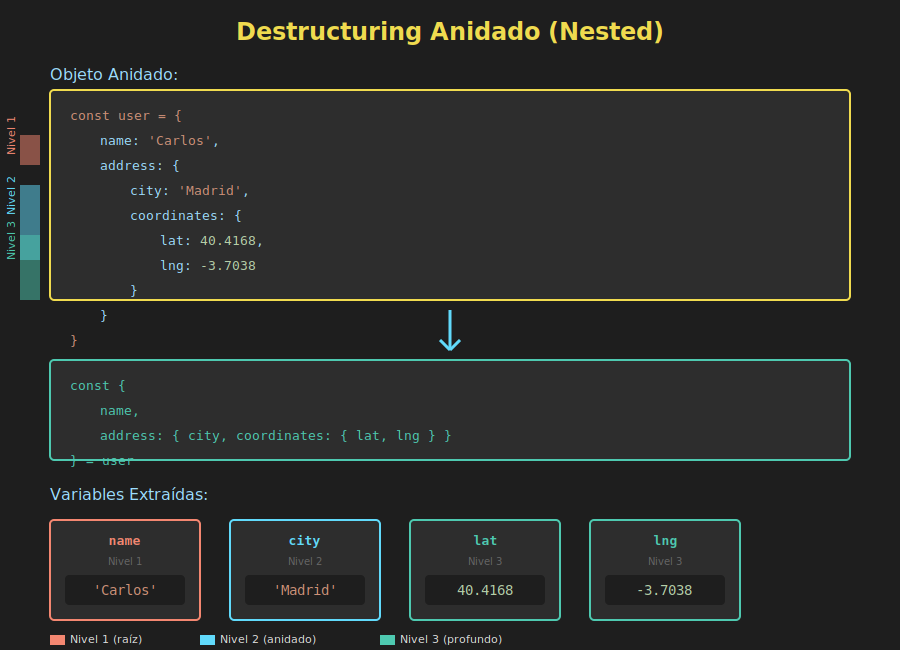

# 🔄 Destructuring Anidado



## 🎯 Objetivos

- Comprender el destructuring de estructuras complejas
- Trabajar con objetos dentro de objetos
- Manejar arrays dentro de objetos y viceversa
- Aplicar destructuring anidado en parámetros
- Usar valores por defecto en estructuras anidadas
- Implementar patrones prácticos del mundo real

---

## 📋 Introducción

El **destructuring anidado** permite extraer valores de estructuras de datos complejas que contienen objetos dentro de objetos, arrays dentro de objetos, o cualquier combinación de ambos. Es especialmente útil cuando trabajas con APIs, configuraciones complejas o datos jerarquizados.

---

## 1️⃣ Objetos Anidados

### Nivel 2 de Anidamiento

```javascript
const user = {
  name: 'Ana García',
  contact: {
    email: 'ana@example.com',
    phone: '+34 600 123 456'
  }
};

// Destructuring anidado
const {
  name,
  contact: { email, phone }
} = user;

console.log(name);  // 'Ana García'
console.log(email); // 'ana@example.com'
console.log(phone); // '+34 600 123 456'

// ⚠️ IMPORTANTE: 'contact' NO se crea como variable
// console.log(contact); // ReferenceError
```

### Múltiples Niveles

```javascript
const user = {
  name: 'Carlos López',
  address: {
    street: 'Gran Vía 123',
    city: 'Madrid',
    location: {
      coordinates: {
        lat: 40.4168,
        lng: -3.7038
      },
      timezone: 'Europe/Madrid'
    }
  }
};

const {
  name,
  address: {
    city,
    location: {
      coordinates: { lat, lng },
      timezone
    }
  }
} = user;

console.log(name);     // 'Carlos López'
console.log(city);     // 'Madrid'
console.log(lat, lng); // 40.4168 -3.7038
console.log(timezone); // 'Europe/Madrid'
```

### Con Alias

```javascript
const response = {
  data: {
    user: {
      id: 1,
      name: 'María Rodríguez'
    }
  }
};

const {
  data: {
    user: {
      id: userId,
      name: userName
    }
  }
} = response;

console.log(userId);   // 1
console.log(userName); // 'María Rodríguez'
```

---

## 2️⃣ Con Valores por Defecto

### Defaults en Cada Nivel

```javascript
const config = {
  server: {
    port: 3000
  }
};

const {
  server: {
    port = 8080,
    host = 'localhost'
  } = {}
} = config;

console.log(port); // 3000
console.log(host); // 'localhost'

// El = {} previene error si 'server' no existe
```

### Prevenir Errores con Objetos Faltantes

```javascript
const user = {
  name: 'Ana'
  // address no existe
};

// ❌ Error sin default para el objeto padre
// const { address: { city } } = user; // TypeError

// ✅ Con default para prevenir error
const {
  address: { city = 'Unknown' } = {}
} = user;

console.log(city); // 'Unknown'
```

### Ejemplo Práctico

```javascript
const fetchUser = () => {
  // Simula respuesta de API
  return {
    data: {
      user: {
        name: 'Pedro',
        settings: {
          theme: 'dark'
        }
      }
    }
  };
};

const {
  data: {
    user: {
      name = 'Anonymous',
      email = 'no-email@example.com',
      settings: {
        theme = 'light',
        language = 'en',
        notifications = true
      } = {}
    } = {}
  } = {}
} = fetchUser();

console.log(name);          // 'Pedro'
console.log(email);         // 'no-email@example.com'
console.log(theme);         // 'dark'
console.log(language);      // 'en'
console.log(notifications); // true
```

---

## 3️⃣ Arrays Anidados

### Array de Arrays

```javascript
const matrix = [
  [1, 2, 3],
  [4, 5, 6],
  [7, 8, 9]
];

const [[a, b, c], [d, e, f], [g, h, i]] = matrix;

console.log(a, e, i); // 1 5 9

// Solo algunos elementos
const [[first], , [, , last]] = matrix;
console.log(first, last); // 1 9
```

### Arrays dentro de Objetos

```javascript
const user = {
  name: 'Ana García',
  scores: [95, 88, 92, 85]
};

const {
  name,
  scores: [highest, ...rest]
} = user;

console.log(name);    // 'Ana García'
console.log(highest); // 95
console.log(rest);    // [88, 92, 85]
```

---

## 4️⃣ Objetos dentro de Arrays

### Destructuring de Elementos

```javascript
const users = [
  { id: 1, name: 'Ana', email: 'ana@example.com' },
  { id: 2, name: 'Carlos', email: 'carlos@example.com' }
];

const [{ name: firstName, email: firstEmail }, { name: secondName }] = users;

console.log(firstName);   // 'Ana'
console.log(firstEmail);  // 'ana@example.com'
console.log(secondName);  // 'Carlos'
```

### Con Iteración

```javascript
const products = [
  { id: 1, name: 'Laptop', price: 999 },
  { id: 2, name: 'Mouse', price: 25 },
  { id: 3, name: 'Keyboard', price: 75 }
];

products.forEach(({ name, price }) => {
  console.log(`${name}: €${price}`);
});
// Laptop: €999
// Mouse: €25
// Keyboard: €75

// Con map
const names = products.map(({ name }) => name);
console.log(names); // ['Laptop', 'Mouse', 'Keyboard']
```

---

## 5️⃣ Combinaciones Complejas

### Objeto con Arrays y Objetos Anidados

```javascript
const company = {
  name: 'Tech Corp',
  employees: [
    {
      name: 'Ana García',
      role: 'Developer',
      skills: ['JavaScript', 'React', 'Node.js'],
      contact: {
        email: 'ana@techcorp.com',
        phone: '+34 600 111 222'
      }
    },
    {
      name: 'Carlos López',
      role: 'Designer',
      skills: ['Figma', 'Photoshop'],
      contact: {
        email: 'carlos@techcorp.com',
        phone: '+34 600 333 444'
      }
    }
  ]
};

const {
  name: companyName,
  employees: [
    {
      name: devName,
      skills: [primarySkill, ...otherSkills],
      contact: { email: devEmail }
    },
    {
      name: designerName,
      contact: { email: designerEmail }
    }
  ]
} = company;

console.log(companyName);     // 'Tech Corp'
console.log(devName);         // 'Ana García'
console.log(primarySkill);    // 'JavaScript'
console.log(otherSkills);     // ['React', 'Node.js']
console.log(devEmail);        // 'ana@techcorp.com'
console.log(designerName);    // 'Carlos López'
console.log(designerEmail);   // 'carlos@techcorp.com'
```

---

## 6️⃣ En Parámetros de Funciones

### Configuración Anidada

```javascript
const createWidget = ({
  title = 'Widget',
  dimensions: {
    width = 300,
    height = 200
  } = {},
  style: {
    color = 'blue',
    fontSize = 14,
    border: {
      width: borderWidth = 1,
      color: borderColor = 'gray'
    } = {}
  } = {}
}) => {
  return {
    title,
    width,
    height,
    color,
    fontSize,
    borderWidth,
    borderColor
  };
};

const widget = createWidget({
  title: 'My Widget',
  dimensions: { width: 500 },
  style: {
    color: 'red',
    border: { width: 2 }
  }
});

console.log(widget);
// {
//   title: 'My Widget',
//   width: 500,
//   height: 200,       // default
//   color: 'red',
//   fontSize: 14,      // default
//   borderWidth: 2,
//   borderColor: 'gray' // default
// }
```

### Procesamiento de Datos de API

```javascript
const displayUser = ({
  data: {
    user: {
      personal: {
        firstName,
        lastName,
        age = null
      },
      contact: {
        email,
        phone = 'Not provided'
      } = {},
      preferences: {
        theme = 'light',
        language = 'en'
      } = {}
    } = {}
  } = {}
} = {}) => {
  console.log(`
    Name: ${firstName} ${lastName}
    Age: ${age || 'Not specified'}
    Email: ${email}
    Phone: ${phone}
    Theme: ${theme}
    Language: ${language}
  `);
};

displayUser({
  data: {
    user: {
      personal: {
        firstName: 'Ana',
        lastName: 'García'
      },
      contact: {
        email: 'ana@example.com'
      }
    }
  }
});
```

---

## 💡 Casos de Uso Prácticos

### 1. Respuestas de GraphQL

```javascript
const processGraphQLResponse = ({
  data: {
    user: {
      id,
      profile: { name, avatar },
      posts: {
        edges
      }
    }
  }
}) => {
  const postTitles = edges.map(({ node: { title } }) => title);
  return { id, name, avatar, postTitles };
};

const response = {
  data: {
    user: {
      id: 1,
      profile: {
        name: 'Ana',
        avatar: 'avatar.jpg'
      },
      posts: {
        edges: [
          { node: { title: 'Post 1' } },
          { node: { title: 'Post 2' } }
        ]
      }
    }
  }
};

console.log(processGraphQLResponse(response));
// { id: 1, name: 'Ana', avatar: 'avatar.jpg', postTitles: ['Post 1', 'Post 2'] }
```

### 2. Configuración de Frameworks

```javascript
const initializeApp = ({
  api: {
    baseURL,
    timeout = 5000,
    headers: {
      authorization,
      contentType = 'application/json'
    } = {}
  },
  features: {
    analytics = true,
    logging = false
  } = {}
} = {}) => {
  return {
    api: { baseURL, timeout, authorization, contentType },
    features: { analytics, logging }
  };
};

const config = initializeApp({
  api: {
    baseURL: 'https://api.example.com',
    headers: {
      authorization: 'Bearer token123'
    }
  }
});
```

### 3. Datos Geográficos

```javascript
const displayLocation = ({
  place: {
    name,
    address: {
      street,
      city,
      country
    },
    coordinates: {
      latitude: lat,
      longitude: lng
    }
  }
}) => {
  return `${name} is located at ${street}, ${city}, ${country} (${lat}, ${lng})`;
};

const location = {
  place: {
    name: 'Puerta del Sol',
    address: {
      street: 'Puerta del Sol',
      city: 'Madrid',
      country: 'España'
    },
    coordinates: {
      latitude: 40.4168,
      longitude: -3.7038
    }
  }
};

console.log(displayLocation(location));
```

### 4. Procesamiento de Formularios

```javascript
const processForm = ({
  personal: {
    name,
    email
  },
  address: {
    street,
    city,
    zipCode
  },
  preferences: {
    newsletter = false,
    notifications = true
  } = {}
}) => {
  return {
    user: { name, email },
    shipping: { street, city, zipCode },
    opts: { newsletter, notifications }
  };
};
```

---

## ⚠️ Errores Comunes

### 1. Olvidar Defaults en Objetos Intermedios

```javascript
const data = { user: { name: 'Ana' } };

// ❌ Error si 'address' no existe
// const { user: { address: { city } } } = data; // TypeError

// ✅ Correcto
const {
  user: {
    address: { city = 'Unknown' } = {}
  }
} = data;
```

### 2. Anidamiento Excesivo

```javascript
// ❌ Demasiado complejo, difícil de leer
const {
  a: { b: { c: { d: { e: { f } } } } }
} = obj;

// ✅ Mejor - paso a paso
const { a } = obj;
const { b } = a;
const { c } = b;
// ...
```

### 3. Confundir Niveles

```javascript
const data = {
  user: {
    name: 'Ana',
    email: 'ana@example.com'
  }
};

// ❌ Intenta destructurar desde el nivel equivocado
// const { name, email } = data; // undefined, undefined

// ✅ Correcto - desde user
const { user: { name, email } } = data;
```

---

## 🎯 Ejercicios Prácticos

### Ejercicio 1

```javascript
const data = {
  company: {
    name: 'Tech Corp',
    location: {
      city: 'Madrid',
      country: 'España'
    }
  }
};

// Extrae companyName (name), city y country
// Tu código aquí:
```

<details>
<summary>Ver solución</summary>

```javascript
const {
  company: {
    name: companyName,
    location: { city, country }
  }
} = data;

console.log(companyName, city, country); // 'Tech Corp' 'Madrid' 'España'
```
</details>

### Ejercicio 2

```javascript
const users = [
  { name: 'Ana', scores: [95, 88, 92] },
  { name: 'Carlos', scores: [87, 90, 85] }
];

// Extrae el nombre y el primer score de cada usuario
// Tu código aquí:
```

<details>
<summary>Ver solución</summary>

```javascript
const [
  { name: firstName, scores: [firstScore] },
  { name: secondName, scores: [secondScore] }
] = users;

console.log(firstName, firstScore);   // 'Ana' 95
console.log(secondName, secondScore); // 'Carlos' 87
```
</details>

---

## ✅ Mejores Prácticas

1. **No exageres** - Si es muy complejo, descompón en pasos
2. **Usa defaults** - Previene errores con objetos faltantes
3. **Documenta** - Comenta estructuras muy anidadas
4. **Considera alternativas** - A veces es más claro acceder directamente

```javascript
// ⚠️ Quizás muy complejo
const {
  a: { b: { c: { d } } }
} = obj;

// ✅ A veces más claro
const d = obj?.a?.b?.c?.d;
```

---

## 📚 Recursos Adicionales

- [MDN: Destructuring Assignment](https://developer.mozilla.org/es/docs/Web/JavaScript/Reference/Operators/Destructuring_assignment)
- [JavaScript.info: Nested Destructuring](https://javascript.info/destructuring-assignment#nested-destructuring)

---

## 🔗 Navegación

- [← Destructuring de Objetos](02-destructuring-objects.md)
- [Módulos ES6 →](04-modulos-es6.md)
- [📑 Ver todos los temas](../README.md#-contenidos)

---

**Próximo tema**: Módulos ES6 - aprenderás a organizar tu código en módulos reutilizables.
