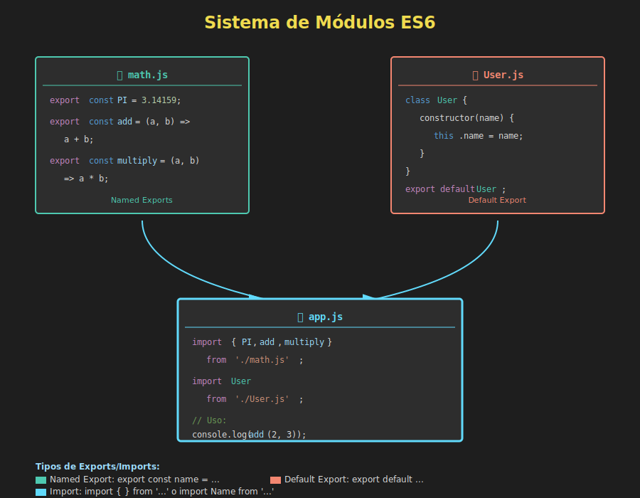

# 📦 Módulos ES6



## 🎯 Objetivos

- Comprender qué son los módulos y por qué son importantes
- Dominar la sintaxis de import/export
- Diferenciar entre named y default exports
- Organizar código en una arquitectura modular
- Implementar re-exports y barrel files
- Aplicar mejores prácticas en proyectos modulares

---

## 📋 ¿Qué son los Módulos?

Los **módulos ES6** son archivos de JavaScript que pueden exportar e importar código entre sí. Permiten:

- ✅ Organizar código en archivos separados
- ✅ Reutilizar funcionalidad
- ✅ Evitar contaminación del scope global
- ✅ Gestionar dependencias de forma clara
- ✅ Facilitar el mantenimiento

### Antes de los Módulos

```html
<!-- index.html -->
<script src="utils.js"></script>
<script src="helpers.js"></script>
<script src="app.js"></script>
<!-- El orden importa, todo en scope global -->
```

### Con Módulos ES6

```html
<!-- index.html -->
<script type="module" src="app.js"></script>
<!-- app.js importa lo que necesita -->
```

---

## 1️⃣ Exportar (Export)

### Named Exports

Exporta múltiples valores por nombre:

```javascript
// math.js
export const PI = 3.14159;

export const add = (a, b) => a + b;

export const subtract = (a, b) => a - b;

export class Calculator {
  multiply(a, b) {
    return a * b;
  }
}
```

O exportar todo al final:

```javascript
// math.js
const PI = 3.14159;

const add = (a, b) => a + b;
const subtract = (a, b) => a - b;

class Calculator {
  multiply(a, b) {
    return a * b;
  }
}

export { PI, add, subtract, Calculator };
```

### Default Export

Exporta un valor principal por archivo:

```javascript
// logger.js
class Logger {
  log(message) {
    console.log(`[LOG]: ${message}`);
  }
  
  error(message) {
    console.error(`[ERROR]: ${message}`);
  }
}

export default Logger;
```

O con funciones:

```javascript
// validator.js
const validateEmail = email => {
  return /^[^\s@]+@[^\s@]+\.[^\s@]+$/.test(email);
};

export default validateEmail;
```

### Combinando Named y Default

```javascript
// api.js
export const BASE_URL = 'https://api.example.com';
export const TIMEOUT = 5000;

class APIClient {
  constructor(baseURL = BASE_URL) {
    this.baseURL = baseURL;
  }
  
  async fetch(endpoint) {
    const response = await fetch(`${this.baseURL}/${endpoint}`);
    return response.json();
  }
}

export default APIClient;
```

---

## 2️⃣ Importar (Import)

### Named Imports

```javascript
// app.js
import { add, subtract, PI } from './math.js';

console.log(add(5, 3));      // 8
console.log(subtract(10, 4)); // 6
console.log(PI);              // 3.14159
```

### Default Import

```javascript
// app.js
import Logger from './logger.js';

const logger = new Logger();
logger.log('Hello World');
```

### Combinando Named y Default

```javascript
// app.js
import APIClient, { BASE_URL, TIMEOUT } from './api.js';

const client = new APIClient();
console.log(BASE_URL, TIMEOUT);
```

### Import Todo (Namespace)

```javascript
// app.js
import * as MathUtils from './math.js';

console.log(MathUtils.add(5, 3));     // 8
console.log(MathUtils.PI);            // 3.14159
const calc = new MathUtils.Calculator();
```

### Import con Alias

```javascript
// app.js
import { add as sum, subtract as diff } from './math.js';

console.log(sum(5, 3));  // 8
console.log(diff(10, 4)); // 6

// Útil para evitar conflictos
import { format as formatDate } from './dateUtils.js';
import { format as formatNumber } from './numberUtils.js';
```

---

## 3️⃣ Re-exports

Permite exportar imports desde un archivo "barril" (barrel file):

### Sintaxis Básica

```javascript
// index.js (barrel file)
export { add, subtract } from './math.js';
export { validateEmail } from './validators.js';
export { default as Logger } from './logger.js';
```

### Re-export con Alias

```javascript
// utils/index.js
export { validateEmail as isValidEmail } from './validators.js';
export { formatDate as fDate } from './formatters.js';
```

### Re-export Todo

```javascript
// utils/index.js
export * from './validators.js';
export * from './formatters.js';
export * from './helpers.js';
```

### Ejemplo Completo de Barrel File

```javascript
// utils/index.js
// Re-exporta desde múltiples módulos

export { validateEmail, validatePhone } from './validators.js';
export { formatDate, formatCurrency } from './formatters.js';
export { capitalize, truncate } from './strings.js';
export { default as Logger } from './logger.js';
export { default as HTTPClient } from './http.js';
```

Ahora puedes importar todo desde un solo lugar:

```javascript
// app.js
import {
  validateEmail,
  formatDate,
  capitalize,
  Logger
} from './utils/index.js';

// o simplemente
import { validateEmail, formatDate } from './utils';
```

---

## 4️⃣ Organización de Proyectos

### Estructura Básica

```
project/
├── src/
│   ├── utils/
│   │   ├── validators.js
│   │   ├── formatters.js
│   │   └── index.js (barrel)
│   ├── services/
│   │   ├── api.js
│   │   ├── auth.js
│   │   └── index.js
│   ├── models/
│   │   ├── User.js
│   │   ├── Product.js
│   │   └── index.js
│   └── app.js
└── index.html
```

### Ejemplo: validators.js

```javascript
// src/utils/validators.js

export const validateEmail = email => {
  return /^[^\s@]+@[^\s@]+\.[^\s@]+$/.test(email);
};

export const validatePhone = phone => {
  return /^\+?[\d\s-()]+$/.test(phone);
};

export const validateAge = age => {
  return Number.isInteger(age) && age >= 0 && age <= 150;
};
```

### Ejemplo: formatters.js

```javascript
// src/utils/formatters.js

export const formatDate = date => {
  return new Date(date).toLocaleDateString('es-ES');
};

export const formatCurrency = (amount, currency = 'EUR') => {
  return new Intl.NumberFormat('es-ES', {
    style: 'currency',
    currency
  }).format(amount);
};

export const formatNumber = number => {
  return new Intl.NumberFormat('es-ES').format(number);
};
```

### Ejemplo: utils/index.js (Barrel)

```javascript
// src/utils/index.js

export * from './validators.js';
export * from './formatters.js';

// O selectivo
export { validateEmail, validatePhone } from './validators.js';
export { formatDate, formatCurrency } from './formatters.js';
```

### Ejemplo: app.js

```javascript
// src/app.js

import {
  validateEmail,
  formatDate,
  formatCurrency
} from './utils/index.js';

const email = 'ana@example.com';
console.log(validateEmail(email)); // true

const today = new Date();
console.log(formatDate(today)); // '18/12/2025'

console.log(formatCurrency(1234.56)); // '1.234,56 €'
```

---

## 5️⃣ Características Especiales

### Side-effect Imports

Importa un módulo solo por sus efectos secundarios:

```javascript
// polyfills.js
if (!Array.prototype.flat) {
  Array.prototype.flat = function() {
    // polyfill implementation
  };
}

// app.js
import './polyfills.js'; // Solo ejecuta el código, no importa nada
```

### Imports Dinámicos (ver siguiente tema)

```javascript
// Carga bajo demanda
const module = await import('./heavy-module.js');
```

---

## 💡 Casos de Uso Prácticos

### 1. Servicios API

```javascript
// services/api.js
class APIService {
  constructor(baseURL) {
    this.baseURL = baseURL;
  }
  
  async get(endpoint) {
    const response = await fetch(`${this.baseURL}/${endpoint}`);
    return response.json();
  }
  
  async post(endpoint, data) {
    const response = await fetch(`${this.baseURL}/${endpoint}`, {
      method: 'POST',
      headers: { 'Content-Type': 'application/json' },
      body: JSON.stringify(data)
    });
    return response.json();
  }
}

export default APIService;

// services/users.js
import APIService from './api.js';

const api = new APIService('https://api.example.com');

export const getUsers = () => api.get('users');
export const getUserById = id => api.get(`users/${id}`);
export const createUser = data => api.post('users', data);

// app.js
import { getUsers, getUserById } from './services/users.js';

const users = await getUsers();
const user = await getUserById(1);
```

### 2. Modelos

```javascript
// models/User.js
export default class User {
  constructor({ id, name, email }) {
    this.id = id;
    this.name = name;
    this.email = email;
  }
  
  get initials() {
    return this.name.split(' ').map(n => n[0]).join('');
  }
}

// models/Product.js
export default class Product {
  constructor({ id, name, price }) {
    this.id = id;
    this.name = name;
    this.price = price;
  }
  
  get formattedPrice() {
    return `€${this.price.toFixed(2)}`;
  }
}

// models/index.js
export { default as User } from './User.js';
export { default as Product } from './Product.js';

// app.js
import { User, Product } from './models/index.js';

const user = new User({ id: 1, name: 'Ana García', email: 'ana@example.com' });
const product = new Product({ id: 1, name: 'Laptop', price: 999 });
```

### 3. Configuración

```javascript
// config/constants.js
export const APP_NAME = 'Mi Aplicación';
export const VERSION = '1.0.0';
export const API_URL = 'https://api.example.com';

// config/settings.js
export default {
  theme: 'dark',
  language: 'es',
  timeout: 5000
};

// config/index.js
export * from './constants.js';
export { default as settings } from './settings.js';

// app.js
import { APP_NAME, VERSION, settings } from './config/index.js';
```

---

## ⚠️ Errores Comunes

### 1. Olvidar Extensión .js

```javascript
// ❌ INCORRECTO (en navegadores)
import { add } from './math';

// ✅ CORRECTO
import { add } from './math.js';
```

### 2. Múltiples Default Exports

```javascript
// ❌ INCORRECTO - solo un default por archivo
export default class User {}
export default class Product {} // SyntaxError

// ✅ CORRECTO - named exports
export class User {}
export class Product {}
```

### 3. Importaciones Circulares

```javascript
// a.js
import { b } from './b.js';
export const a = 1;

// b.js
import { a } from './a.js'; // ⚠️ Dependencia circular
export const b = 2;

// Evita este patrón
```

### 4. Mezclar CommonJS con ES6

```javascript
// ❌ INCORRECTO - no mezcles
const module = require('./module'); // CommonJS
import { func } from './other.js';  // ES6

// ✅ CORRECTO - usa solo ES6
import module from './module.js';
import { func } from './other.js';
```

---

## 🎯 Ejercicios Prácticos

### Ejercicio 1

Crea un módulo `math.js` que exporte las funciones `add`, `subtract`, `multiply` y `divide`.

<details>
<summary>Ver solución</summary>

```javascript
// math.js
export const add = (a, b) => a + b;
export const subtract = (a, b) => a - b;
export const multiply = (a, b) => a * b;
export const divide = (a, b) => a / b;

// app.js
import { add, multiply } from './math.js';
console.log(add(5, 3));      // 8
console.log(multiply(4, 7)); // 28
```
</details>

### Ejercicio 2

Crea un barrel file para agrupar validators y formatters.

<details>
<summary>Ver solución</summary>

```javascript
// utils/index.js
export { validateEmail } from './validators.js';
export { formatDate } from './formatters.js';

// app.js
import { validateEmail, formatDate } from './utils/index.js';
```
</details>

---

## ✅ Mejores Prácticas

1. **Un archivo, una responsabilidad**
2. **Usa barrel files para agrupar módulos relacionados**
3. **Prefiere named exports para tree-shaking**
4. **Default export para la exportación principal**
5. **Nombres de archivos descriptivos**
6. **Estructura de carpetas lógica**

---

## 📚 Recursos Adicionales

- [MDN: import](https://developer.mozilla.org/es/docs/Web/JavaScript/Reference/Statements/import)
- [MDN: export](https://developer.mozilla.org/es/docs/Web/JavaScript/Reference/Statements/export)

---

## 🔗 Navegación

- [← Destructuring Anidado](03-destructuring-anidado.md)
- [Dynamic Imports →](05-dynamic-imports.md)
- [📑 Ver todos los temas](../README.md#-contenidos)
