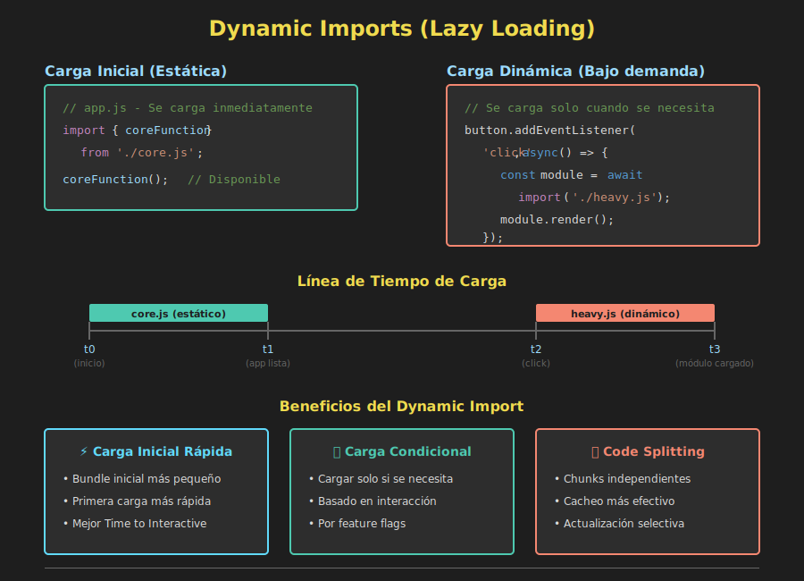

# ⚡ Dynamic Imports



## 🎯 Objetivos

- Comprender qué son los dynamic imports
- Dominar la sintaxis de import()
- Implementar carga condicional de módulos
- Aplicar code splitting básico
- Manejar errores en importaciones dinámicas
- Optimizar rendimiento con lazy loading

---

## 📋 ¿Qué son los Dynamic Imports?

Los **dynamic imports** permiten cargar módulos de forma **asíncrona** y **bajo demanda**, en lugar de cargar todo al inicio de la aplicación. Esto es especialmente útil para:

- ✅ Reducir el tiempo de carga inicial
- ✅ Cargar código solo cuando se necesita
- ✅ Implementar code splitting
- ✅ Carga condicional basada en lógica
- ✅ Mejorar el rendimiento general

### Imports Estáticos vs Dinámicos

```javascript
// IMPORT ESTÁTICO
// Se carga al inicio, síncronamente
import { add } from './math.js';

// IMPORT DINÁMICO
// Se carga bajo demanda, asíncronamente
const math = await import('./math.js');
const result = math.add(5, 3);
```

---

## 1️⃣ Sintaxis Básica

### Con async/await

```javascript
const loadModule = async () => {
  const module = await import('./myModule.js');
  module.doSomething();
};
```

### Con Promesas

```javascript
import('./myModule.js')
  .then(module => {
    module.doSomething();
  })
  .catch(error => {
    console.error('Error loading module:', error);
  });
```

### Ejemplo Completo

```javascript
// heavyModule.js
export const processLargeData = data => {
  console.log('Processing large data...');
  return data.map(item => item * 2);
};

export default class DataProcessor {
  process(data) {
    return processLargeData(data);
  }
}

// app.js
button.addEventListener('click', async () => {
  // Solo se carga cuando el usuario hace clic
  const module = await import('./heavyModule.js');
  
  // Acceder a exports
  const result = module.processLargeData([1, 2, 3, 4, 5]);
  console.log(result); // [2, 4, 6, 8, 10]
  
  // Acceder al default export
  const processor = new module.default();
  processor.process([10, 20, 30]);
});
```

---

## 2️⃣ Carga Condicional

Cargar módulos solo cuando se cumple una condición:

### Basado en Lógica

```javascript
const loadFeature = async feature => {
  if (feature === 'charts') {
    const chartsModule = await import('./charts.js');
    chartsModule.renderChart();
  } else if (feature === 'tables') {
    const tablesModule = await import('./tables.js');
    tablesModule.renderTable();
  }
};

// Cargar según el feature flag
loadFeature('charts');
```

### Basado en Usuario

```javascript
const loadUserFeatures = async user => {
  if (user.isPremium) {
    const premiumModule = await import('./premiumFeatures.js');
    premiumModule.initializePremiumUI();
  } else {
    const basicModule = await import('./basicFeatures.js');
    basicModule.initializeBasicUI();
  }
};

const user = { isPremium: true };
loadUserFeatures(user);
```

### Basado en Entorno

```javascript
const loadConfig = async () => {
  const env = process.env.NODE_ENV;
  
  if (env === 'development') {
    const devConfig = await import('./config.dev.js');
    return devConfig.default;
  } else {
    const prodConfig = await import('./config.prod.js');
    return prodConfig.default;
  }
};

const config = await loadConfig();
```

---

## 3️⃣ Code Splitting

Divide tu código en chunks más pequeños que se cargan bajo demanda:

### Por Rutas (SPA)

```javascript
const router = {
  routes: {
    '/': async () => {
      const home = await import('./pages/Home.js');
      home.render();
    },
    '/about': async () => {
      const about = await import('./pages/About.js');
      about.render();
    },
    '/contact': async () => {
      const contact = await import('./pages/Contact.js');
      contact.render();
    }
  },
  
  navigate(path) {
    const handler = this.routes[path];
    if (handler) {
      handler();
    }
  }
};

// Solo carga la página que el usuario visita
router.navigate('/about');
```

### Por Funcionalidad

```javascript
const features = {
  async loadEditor() {
    const editor = await import('./features/editor.js');
    return editor.initialize();
  },
  
  async loadChat() {
    const chat = await import('./features/chat.js');
    return chat.connect();
  },
  
  async loadAnalytics() {
    const analytics = await import('./features/analytics.js');
    return analytics.track();
  }
};

// Cargar solo cuando el usuario necesita la funcionalidad
document.getElementById('edit-btn').addEventListener('click', () => {
  features.loadEditor();
});
```

---

## 4️⃣ Manejo de Errores

Siempre maneja los errores de carga:

### Try/Catch con async/await

```javascript
const loadModule = async modulePath => {
  try {
    const module = await import(modulePath);
    return module;
  } catch (error) {
    console.error(`Failed to load module: ${modulePath}`, error);
    return null;
  }
};

const math = await loadModule('./math.js');
if (math) {
  console.log(math.add(5, 3));
}
```

### Catch con Promesas

```javascript
import('./module.js')
  .then(module => {
    module.initialize();
  })
  .catch(error => {
    console.error('Module loading failed:', error);
    // Mostrar mensaje al usuario o cargar fallback
  });
```

### Con Fallback

```javascript
const loadModuleWithFallback = async (primaryPath, fallbackPath) => {
  try {
    return await import(primaryPath);
  } catch (error) {
    console.warn(`Primary module failed, loading fallback`);
    return await import(fallbackPath);
  }
};

const utils = await loadModuleWithFallback(
  './utils.modern.js',
  './utils.legacy.js'
);
```

---

## 5️⃣ Lazy Loading

Cargar recursos pesados solo cuando sea necesario:

### Cargar al Hacer Scroll

```javascript
const observer = new IntersectionObserver(async entries => {
  for (const entry of entries) {
    if (entry.isIntersecting) {
      const section = entry.target;
      const modulePath = section.dataset.module;
      
      const module = await import(`./${modulePath}.js`);
      module.render(section);
      
      observer.unobserve(section);
    }
  }
});

document.querySelectorAll('[data-module]').forEach(section => {
  observer.observe(section);
});
```

### Cargar al Interactuar

```javascript
let chartModule = null;

const loadChartModule = async () => {
  if (!chartModule) {
    chartModule = await import('./charts.js');
  }
  return chartModule;
};

document.getElementById('show-chart').addEventListener('click', async () => {
  const charts = await loadChartModule();
  charts.renderChart(data);
});
```

---

## 6️⃣ Optimizaciones

### Pre-loading (Precarga)

```javascript
// Precarga módulo sin ejecutarlo
const preloadModule = modulePath => {
  const link = document.createElement('link');
  link.rel = 'modulepreload';
  link.href = modulePath;
  document.head.appendChild(link);
};

// Precarga módulos que probablemente se usarán
preloadModule('./likely-needed.js');
```

### Caching de Módulos

```javascript
const moduleCache = new Map();

const loadModuleOnce = async modulePath => {
  if (moduleCache.has(modulePath)) {
    return moduleCache.get(modulePath);
  }
  
  const module = await import(modulePath);
  moduleCache.set(modulePath, module);
  return module;
};

// Primera carga - descarga del servidor
const math1 = await loadModuleOnce('./math.js');

// Segunda carga - desde cache
const math2 = await loadModuleOnce('./math.js');
```

### Loading Indicators

```javascript
const loadWithIndicator = async modulePath => {
  // Mostrar spinner
  showLoadingSpinner();
  
  try {
    const module = await import(modulePath);
    return module;
  } catch (error) {
    showError('Failed to load module');
    throw error;
  } finally {
    hideLoadingSpinner();
  }
};

const showLoadingSpinner = () => {
  document.getElementById('spinner').classList.add('visible');
};

const hideLoadingSpinner = () => {
  document.getElementById('spinner').classList.remove('visible');
};
```

---

## 💡 Casos de Uso Prácticos

### 1. Modal/Dialog Dinámico

```javascript
const showUserProfile = async userId => {
  showLoadingSpinner();
  
  try {
    // Cargar módulo de perfil solo cuando se necesita
    const profileModule = await import('./components/UserProfile.js');
    const user = await fetchUser(userId);
    
    profileModule.renderProfile(user);
  } catch (error) {
    console.error('Failed to load profile:', error);
  } finally {
    hideLoadingSpinner();
  }
};

document.getElementById('view-profile').addEventListener('click', () => {
  showUserProfile(123);
});
```

### 2. Internacionalización (i18n)

```javascript
const translations = {};

const loadLanguage = async language => {
  if (translations[language]) {
    return translations[language];
  }
  
  const module = await import(`./i18n/${language}.js`);
  translations[language] = module.default;
  return module.default;
};

const changeLanguage = async language => {
  const t = await loadLanguage(language);
  updateUI(t);
};

// Cargar solo el idioma seleccionado
changeLanguage('es'); // Solo carga es.js
```

### 3. Feature Flags

```javascript
const features = {
  enableBetaFeatures: true,
  enableAnalytics: true
};

const initializeApp = async () => {
  // Características base siempre cargadas
  const core = await import('./core.js');
  core.initialize();
  
  // Características opcionales
  if (features.enableBetaFeatures) {
    const beta = await import('./features/beta.js');
    beta.enable();
  }
  
  if (features.enableAnalytics) {
    const analytics = await import('./features/analytics.js');
    analytics.initialize();
  }
};

initializeApp();
```

### 4. A/B Testing

```javascript
const loadExperimentVariant = async () => {
  const variant = Math.random() < 0.5 ? 'A' : 'B';
  
  const module = await import(`./experiments/variant${variant}.js`);
  module.render();
  
  // Registrar qué variante vio el usuario
  console.log(`User saw variant ${variant}`);
};

loadExperimentVariant();
```

---

## ⚠️ Consideraciones Importantes

### 1. Rendimiento

```javascript
// ❌ Cargar todo dinámicamente puede ser más lento
const module1 = await import('./tiny-module.js');
const module2 = await import('./another-tiny.js');

// ✅ Agrupa módulos pequeños en uno más grande
const modules = await import('./combined-modules.js');
```

### 2. Compatibilidad

Los dynamic imports son compatibles con navegadores modernos. Para navegadores antiguos, necesitas un bundler (Webpack, Rollup, etc.).

### 3. Rutas Dinámicas

```javascript
// ⚠️ Las rutas completamente dinámicas son difíciles de analizar
const language = getUserLanguage();
const module = await import(`./i18n/${language}.js`);

// ✅ Mejor usar un switch o map conocido
const loadLanguage = async language => {
  const languages = {
    'en': () => import('./i18n/en.js'),
    'es': () => import('./i18n/es.js'),
    'fr': () => import('./i18n/fr.js')
  };
  
  return await languages[language]();
};
```

---

## 🎯 Ejercicios Prácticos

### Ejercicio 1

Crea un botón que cargue dinámicamente un módulo de utilidades solo al hacer clic.

<details>
<summary>Ver solución</summary>

```javascript
// utils.js
export const greet = name => `Hello, ${name}!`;
export const sum = (a, b) => a + b;

// app.js
document.getElementById('load-btn').addEventListener('click', async () => {
  const utils = await import('./utils.js');
  console.log(utils.greet('Ana'));
  console.log(utils.sum(5, 3));
});
```
</details>

### Ejercicio 2

Implementa carga condicional de módulos basado en el rol del usuario.

<details>
<summary>Ver solución</summary>

```javascript
const loadUserDashboard = async user => {
  if (user.role === 'admin') {
    const adminDash = await import('./dashboards/admin.js');
    adminDash.render();
  } else {
    const userDash = await import('./dashboards/user.js');
    userDash.render();
  }
};

loadUserDashboard({ role: 'admin' });
```
</details>

---

## ✅ Mejores Prácticas

1. **Usa para módulos grandes o poco usados**
2. **Maneja siempre los errores de carga**
3. **Muestra indicadores de carga al usuario**
4. **Precarga módulos críticos**
5. **Cache módulos ya cargados**
6. **No abuses - los imports estáticos son más eficientes para código inicial**

---

## 📚 Recursos Adicionales

- [MDN: import()](https://developer.mozilla.org/es/docs/Web/JavaScript/Reference/Operators/import)
- [JavaScript.info: Dynamic imports](https://javascript.info/modules-dynamic-imports)
- [Web.dev: Code Splitting](https://web.dev/code-splitting/)

---

## 🔗 Navegación

- [← Módulos ES6](04-modulos-es6.md)
- [Ejercicios Prácticos →](../2-practicas/)
- [📑 Ver todos los temas](../README.md#-contenidos)

---

**¡Felicidades!** Has completado toda la teoría de Week 04. Ahora es momento de practicar con los ejercicios. 🚀
